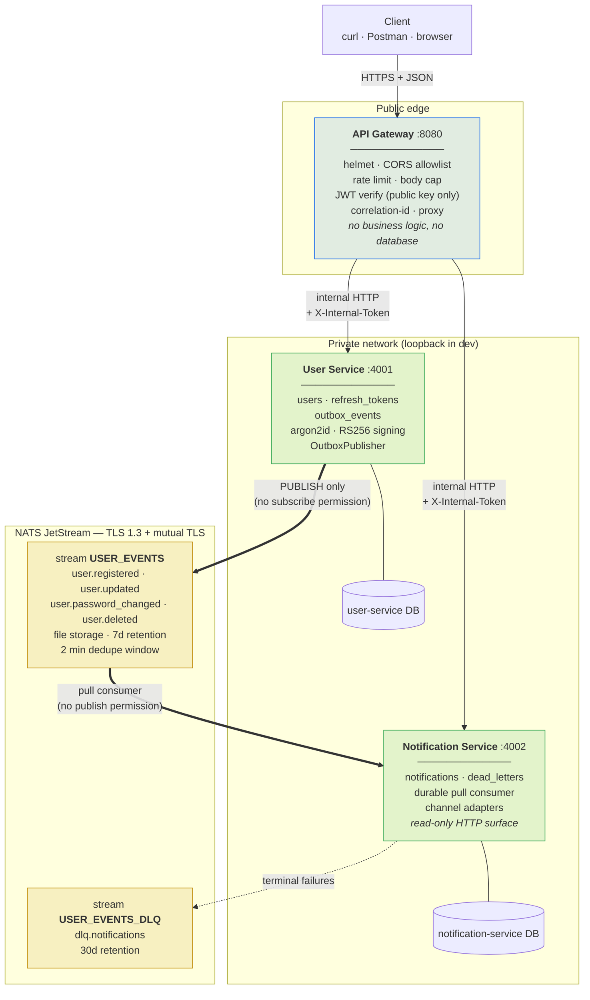
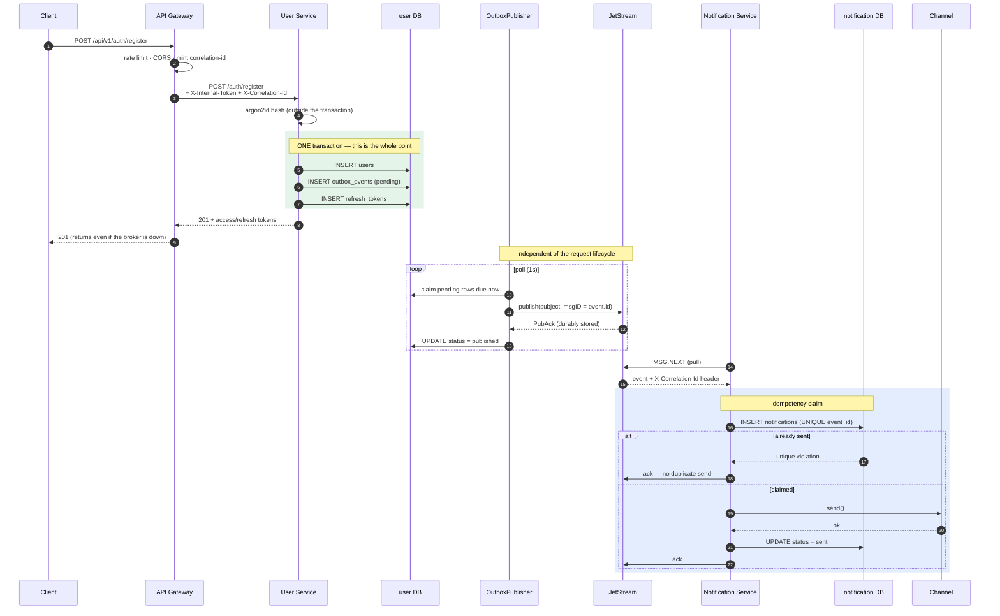
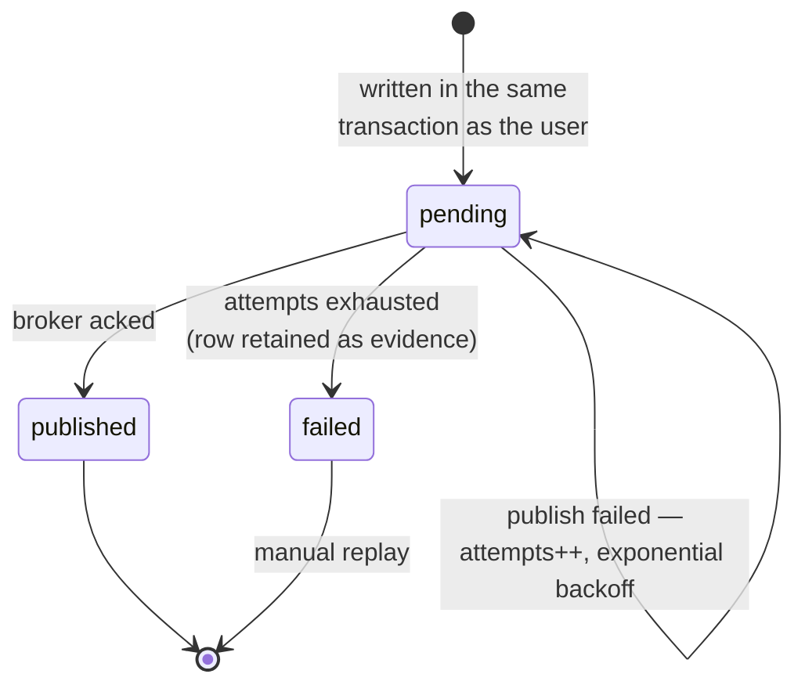
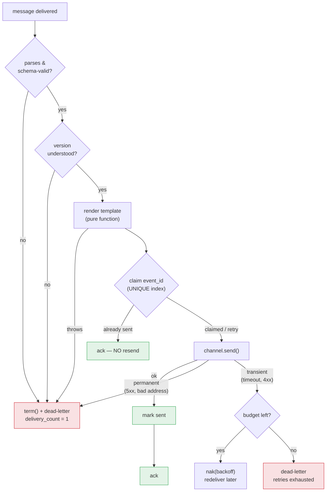
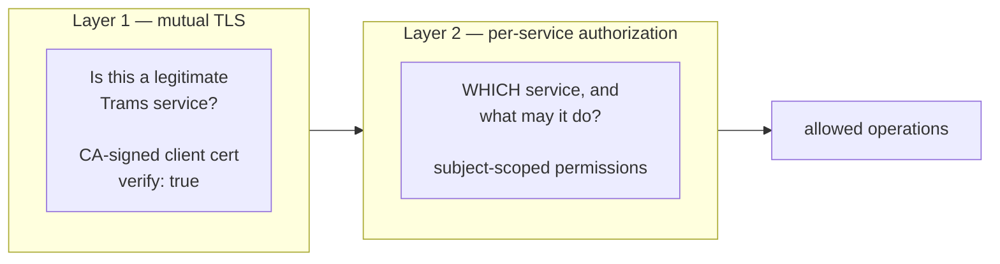
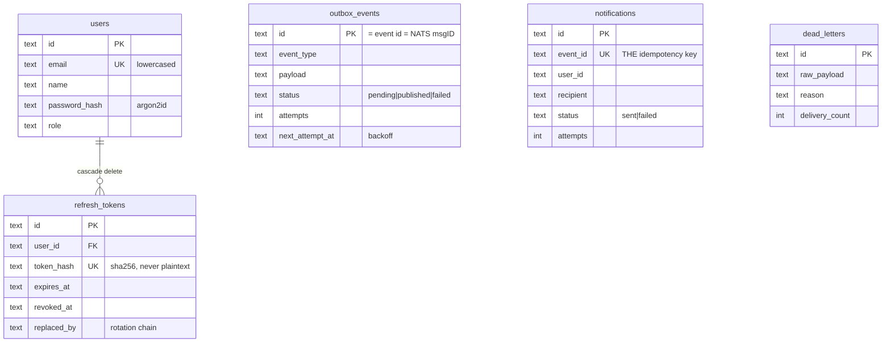

# Architecture

How the three components fit together, and — more usefully — _why_ each
significant decision went the way it did.

The brief's central constraint is that the User Service and the Notification
Service must communicate without REST or WebSockets. Everything below follows
from taking that seriously: not as an inconvenience to route around, but as the
thing being tested.

---

## 1. System overview



**The load-bearing property:** the two backend services share no HTTP route, no
socket, and no database. Their only connection is the JetStream stream. You can
verify this rather than take it on trust — `tests/integration/security.test.ts`
asserts that each service's broker credentials are _denied_ the other's
operations.

**Why the gateway→service hop is HTTP.** The brief forbids REST/WS only
_between_ the two services. A gateway that could not call its services would be
a broker, not a gateway. What matters is that no domain logic lives there, so
the gateway stays replaceable and the services stay independently testable.

---

## 2. The write path: how an event reaches the consumer



Note step 5–7: the client gets its `201` _before_ anything touches the broker.
That is deliberate, and it is what makes broker availability irrelevant to user
registration.

---

## 3. Reliability: the transactional outbox

### The problem

The obvious implementation is:

```ts
await db.insertUser(user);
await broker.publish(event); // ← the bug
```

There is no transaction spanning a database and a message broker, so the second
line has a failure window. Kill the process between the two statements, or make
the broker briefly unreachable, and the user exists while the event does not.

The important part: **no amount of retry logic around the publish call closes
this gap**, because the gap is between two systems that cannot commit together.
Reversing the order does not help either — publish-then-insert can notify a user
whose registration subsequently fails.

### The fix

Write the event into a table in the same transaction as the domain change, then
drain that table asynchronously.



| Property                                    | Consequence                                         |
| ------------------------------------------- | --------------------------------------------------- |
| Event commits with the user                 | No state where one exists without the other         |
| Publish happens out-of-band                 | Broker downtime never fails a user request          |
| Retries with jittered backoff               | A recovering broker is not hit by a thundering herd |
| Exhausted rows become `failed`, not deleted | An operator can see and replay what never made it   |
| Delivery is at-least-once                   | Duplicates are possible; **loss is not**            |

That last row is the deliberate trade. A duplicate is recoverable at the
consumer; a lost event is recoverable nowhere.

_Verified by:_ `tests/integration/reliability.test.ts › broker outage` and
`tests/unit/outbox-publisher.test.ts`.

### Multiple producer replicas

With one User Service instance the `claimDue` query is safe as written. With
several, two publishers could claim the same row and both publish it — which is
**safe but wasteful**, because the broker deduplicates on `msgID` and the
consumer deduplicates on `event_id`.

To make it efficient rather than merely correct, Postgres offers
`SELECT … FOR UPDATE SKIP LOCKED`. That is deliberately _not_ applied in the
code: SQLite has no equivalent, and adding a dialect-specific claim path would
mean the tested code and the deployed code diverge. It is a one-line change in
`OutboxRepository.claimDue` when a Postgres-only deployment needs it.

---

## 4. Reliability: the consumer

JetStream guarantees **at-least-once** delivery. The same event _will_ arrive
twice — after an `ack_wait` expiry, a worker crash, a lost ack, or a publisher
retry. Without protection, each of those sends a second email, and no broker
setting can fix it because the side effect is external: nothing can retract a
sent email.



Four decisions worth calling out:

**Pull, not push.** A push consumer delivers at the _broker's_ pace; a pull
consumer delivers at the _worker's_ pace. Since delivery waits on a slow
external dependency, the worker must control its own intake or a burst buries
it.

**Idempotency is a database constraint, not application code.** The obvious
`SELECT … if not exists then INSERT` is a race two replicas will eventually
lose. A `UNIQUE` index on `notifications.event_id` is arbitrated by the database
and stays correct at any concurrency. This is the single most important line in
the schema.

**`nak` and `term` are different decisions.** An SMTP timeout is transient →
retry. A malformed recipient will fail identically forever → dead-letter
immediately. Treating both the same way either wastes the retry budget on
something hopeless or discards something recoverable.

**Nothing is dropped silently.** `max_deliver` alone would let the broker
discard a message with no record of why. The runtime dead-letters _before_
hitting that ceiling, writing the payload and reason to both a queryable table
and the DLQ stream.

### Honest limitation

There is one irreducible window: if the process dies _after_ the channel has
sent but _before_ `markSent` commits, a redelivery sends again. Closing it would
need a distributed transaction across the database and the mail server, which
does not exist. The design takes the safe side — a rare duplicate rather than a
silent omission — and the window is milliseconds wide.

Calling this "exactly-once" would be false. It is exactly-once _effect_ except
across a crash in that window.

---

## 5. Security

Two independent layers on the broker, and defence in depth on HTTP.



| Service                | May publish                            | May subscribe   | Cannot                   |
| ---------------------- | -------------------------------------- | --------------- | ------------------------ |
| `user-service`         | `user.>`, stream/consumer provisioning | `_INBOX.>` only | **read the stream back** |
| `notification-service` | `dlq.>`, ack its own consumer          | `_INBOX.>` only | **publish `user.*`**     |

The consequence, and the point of the exercise: a compromised Notification
Service cannot forge a `user.registered` event, and a compromised User Service
cannot read the event history. Neither can do the other's job — enforced by the
broker, not by convention.

Worth noting: there is no `subscribe` permission on `user.>` anywhere, and none
is needed. With a _pull_ consumer, messages arrive as replies on a private
inbox, so read access is expressed entirely through consumer permissions — a
tighter and more auditable grant than a subject subscription.

Full threat-model mapping in [security.md](security.md).

---

## 6. Tracing across the async boundary

An asynchronous system is only debuggable if one identifier spans the whole
path. The correlation id is threaded:

```
inbound header (or minted)
  → AsyncLocalStorage (every log line picks it up automatically)
    → outbox_events.correlation_id
      → NATS header X-Correlation-Id
        → consumer's AsyncLocalStorage
          → notifications.correlation_id
            → echoed back on the HTTP response
```

So one `grep` reconstructs a request across three processes and the broker, and
a client that sees a 500 can quote an id that maps to exact log lines.

---

## 7. Scalability

| Concern               | Mechanism                                                                                                                    |
| --------------------- | ---------------------------------------------------------------------------------------------------------------------------- |
| Stateless services    | Access tokens are self-contained JWTs — no session store, no sticky sessions                                                 |
| Gateway replicas      | No local state; scale freely behind a load balancer                                                                          |
| Notification replicas | N workers share one durable consumer; JetStream partitions the work, and the `event_id` index guarantees one send regardless |
| Backpressure          | `max_ack_pending` bounds unacked work so a burst cannot exhaust worker memory                                                |
| Consumer throughput   | Pull batching (`NOTIFICATION_FETCH_BATCH`)                                                                                   |
| Read scaling          | Indexes on `(user_id, created_at)` and `(status, next_attempt_at)` keep the hot queries range scans                          |
| Broker durability     | `num_replicas` is 1 for a single-node dev broker; raise to 3 in a cluster                                                    |

The honest limit: the outbox publisher is currently one loop per User Service
instance, publishing sequentially to preserve per-user event ordering. That
caps throughput at roughly `batchSize / pollInterval` per replica. Adding
replicas scales it linearly, and `SKIP LOCKED` (above) removes the wasted
duplicate work.

---

## 8. Repository layout

```
packages/shared/          the event contract + everything both services agree on
  events/                 envelope, per-type zod schemas, subject constants
  nats/                   connect · stream bootstrap · publisher · consumer runtime
  db/                     Kysely schema, dialect factory, migrations
  http/                   correlation · error handler · health · auth guards
  auth/                   AccessTokenVerifier (PUBLIC key only)
  config.ts               zod-validated env, fail-fast at boot
services/user-service/    produces events via the outbox
services/notification-service/  consumes events, delivers notifications
services/api-gateway/     the only public listener
infra/nats/nats.conf      TLS + per-service subject permissions
```

The monorepo exists for one reason: **the event contract is a shared artifact.**
If each service kept its own copy of the message shape they would drift, and the
first schema change would break the consumer at runtime with no warning. One
`packages/shared/events` module imported by both makes a mismatch a compile
error.

---

## 9. Data model

Two databases, one per service — a shared database between microservices is
exactly the coupling this design exists to avoid.



**On column types:** only the intersection of SQLite's and Postgres's type
systems is used — `text`, `integer`, and ISO-8601 timestamps stored as text
(which sort lexicographically in chronological order). No native `uuid`,
`jsonb`, or `enum`.

The cost is giving up database-level JSON querying and enum enforcement, which
are validated with zod at the boundary instead. The benefit is that one Kysely
query layer serves both dialects, so "works locally on SQLite" and "works in
compose on Postgres" are the same code — and the Postgres path is exercised by
exactly the code the test suite runs.
