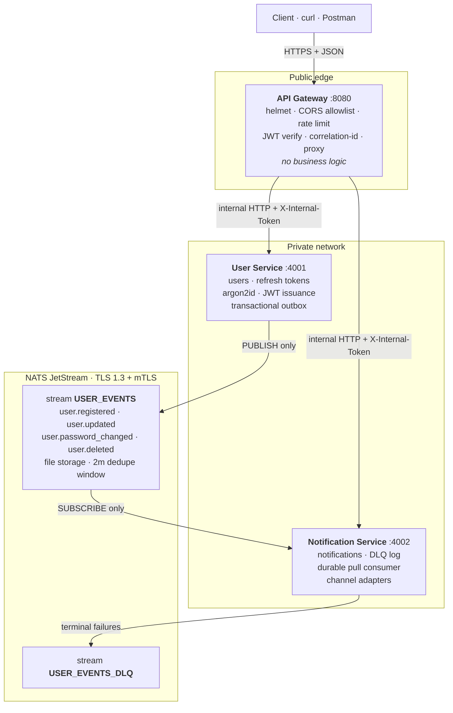
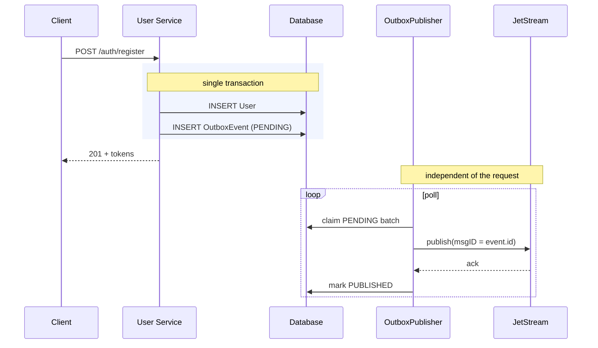

# Trams — Implementation Plan

Event-driven microservices system: **API Gateway**, **User Service**, **Notification Service**.
The two backend services communicate exclusively over **NATS JetStream** — no REST, no WebSockets, no shared database.

> The original assignment brief is preserved verbatim at [`docs/assignment.md`](docs/assignment.md).

---

## Status: implemented

This plan has been executed. What the sections below describe is what was
built, with two deviations recorded inline where they occur:

- **§6 Data layer** — Prisma was replaced with **Kysely**. Reasoning in that section.
- **§8 Running it locally** — `docker compose` is written and reviewed but **not
  executed**, because Docker is not installed on the build machine. The native
  `nats-server` + SQLite path was run end to end.

Verified state at completion:

| Gate                 | Result                                                                          |
| -------------------- | ------------------------------------------------------------------------------- |
| `npm test`           | **97 passing** (67 unit, 30 integration against a real broker)                  |
| `npm run smoke`      | **26/26** end-to-end checks against three live processes                        |
| `npm run typecheck`  | clean (`tsc --build --force`, all projects)                                     |
| `npm run lint`       | clean, zero warnings                                                            |
| Broker-outage test   | `201` returned with the broker down; event published on recovery, **zero loss** |
| Duplicate delivery   | 3 deliveries of one event → 1 notification                                      |
| Poison message       | dead-lettered at `delivery_count: 1`, not retried                               |
| Broker authorization | consumer denied `publish user.registered`; producer denied stream reads         |

Three defects were found by this project's own tests during the build and fixed:
a rate limiter returning 500 instead of 429, a CORS rejection returning 500
instead of 403, and an `OutboxPublisher` batch loop that abandoned every row
after the first when invoked outside the polling loop. The last of these is
pinned by a regression test.

Runnable instructions are in [`README.md`](README.md).

---

## 1. Reading of the assignment

The brief asks for three components, but the actual subject being graded is the **edge between the two backend services**. Any junior developer can wire up two Express apps; the brief deliberately removes the easy option and then names its criteria: _distributed systems, secure inter-service communication, event-driven architecture, scalability, clean code_.

So this plan is organised around the five things that are hard to fake:

| Brief says                        | Which really means                                                       | Answered by                                                          |
| --------------------------------- | ------------------------------------------------------------------------ | -------------------------------------------------------------------- |
| "without REST APIs or WebSockets" | Model the domain as **events**, not as remote function calls             | Versioned event contract, publish/subscribe only                     |
| "Reliable"                        | No lost messages, no duplicate side-effects, poison messages quarantined | Transactional outbox + durable consumer + idempotency + DLQ          |
| "Secure"                          | The broker is a trust boundary, not plumbing                             | mTLS + per-service subject permissions                               |
| "Production-ready"                | Survives restarts, broker outages, and bad input                         | Graceful shutdown, readiness probes, retry/backoff, fail-fast config |
| "Scalable"                        | Add replicas without coordination or double-sends                        | Stateless services, shared durable consumer                          |

An explicit non-goal: feature breadth. A handful of endpoints done properly beats a large surface done shallowly.

---

## 2. Architecture



**The load-bearing constraint:** User Service and Notification Service share no HTTP route, no socket, and no database. Their only connection is the JetStream stream. The gateway↔service hop _is_ HTTP — the brief forbids REST/WS only _between_ the two services, and a gateway that couldn't call its services would be a broker, not a gateway.

**Why the gateway holds no business logic:** it is a policy layer (authn, rate limiting, tracing, error normalisation). Keeping domain rules out of it means the services stay independently testable and the gateway stays replaceable.

### Repository layout

```
Trams/
├─ package.json                 npm workspaces + root scripts
├─ tsconfig.base.json           strict: true, composite project refs
├─ .env.example                 every variable, no real secrets
├─ .gitignore                   .env · dist · *.db · infra/nats/certs
├─ docker-compose.yml           nats + postgres + 3 services
├─ plan.md                      this document
├─ README.md                    setup · run · demo walkthrough
├─ docs/
│   ├─ assignment.md            original brief, verbatim
│   ├─ architecture.md          mermaid: system · event flow · outbox sequence
│   ├─ api.md                   human-readable endpoint reference
│   ├─ openapi.yaml             OpenAPI 3.1 for the public surface
│   └─ security.md              threat model → control mapping
├─ infra/
│   ├─ nats/nats.conf           TLS · accounts · per-service subject permissions
│   └─ scripts/gen-certs.mjs    openssl CA + server + per-service client certs
├─ packages/shared/src/
│   ├─ config.ts                zod-validated env loader, fail-fast at boot
│   ├─ logger.ts                pino, redacts password/token/authorization
│   ├─ errors.ts                AppError taxonomy → application/problem+json
│   ├─ events/                  envelope + per-type zod schemas + subject constants
│   ├─ nats/                    connect · stream bootstrap · publisher · consumer runtime
│   └─ http/                    requestId · errorHandler · health/ready plugins
└─ services/
    ├─ api-gateway/
    ├─ user-service/
    └─ notification-service/
```

A monorepo because the **event contract is a shared artifact**. If the producer and consumer each keep their own copy of the message shape, they drift, and the first schema change becomes a silent production incident. One `packages/shared/events` module, imported by both, makes drift a compile error instead.

---

## 3. The event contract

```ts
{
  id: string; // uuid — also the JetStream Nats-Msg-Id
  type: string; // "user.registered"
  version: number; // 1 — consumers branch on this, never guess
  occurredAt: string; // ISO-8601, set by the producer
  correlationId: string; // threaded from the originating HTTP request
  actor: {
    userId: string;
  }
  data: unknown; // validated by a per-type zod schema
}
```

Four deliberate choices:

- **`id` doubles as `Nats-Msg-Id`** — the broker itself dedupes within its window, so a publisher retry after an ambiguous timeout costs nothing.
- **`version` is in the envelope** — the only way to evolve a payload without a coordinated deploy of both services.
- **`correlationId` is threaded** HTTP header → outbox row → NATS header → consumer log line. One `grep` reconstructs a request's path across all three services and the broker. Without this, debugging an async system means guessing.
- **Subjects are exported constants**, never inline strings. A typo in a subject name is otherwise a message that silently goes nowhere — the worst class of bug in pub/sub.

---

## 4. Reliability

### 4.1 Transactional outbox (User Service)

The naive implementation — save the user, then publish the event — has a failure window. If the process dies between the two, or the broker is briefly unreachable, the user exists and the notification never happens. No amount of retry logic _around_ the publish call closes that gap, because the gap is between two systems that don't share a transaction.



The event is committed **with** the user, atomically. A separate `OutboxPublisher` drains it afterwards. Consequences worth stating plainly:

- Broker down at request time → the user still registers, `201` still returns, the event publishes when the broker returns. Availability is decoupled from the broker.
- Publish failure → `attempts++`, exponential `nextAttemptAt`, retried. After N attempts → `FAILED` + error log, and the row is still on disk as evidence rather than lost.
- Delivery is **at-least-once**, never at-most-once. Which shifts the burden to the consumer — handled next.

### 4.2 Durable consumer (Notification Service)

| Concern            | Mechanism                                                                     |
| ------------------ | ----------------------------------------------------------------------------- |
| Delivery guarantee | durable **pull** consumer, `ack_policy: explicit`, `ack_wait: 30s`            |
| Duplicate delivery | unique index on `notifications.eventId` → duplicate is acked, **not** re-sent |
| Transient failure  | `nak(delay)` with backoff derived from `msg.info.deliveryCount`               |
| Poison message     | `max_deliver: 5` → publish to `notifications.dlq`, then `term()`              |
| Backpressure       | `max_ack_pending` cap                                                         |
| Horizontal scale   | N replicas share one durable consumer → work partitions automatically         |

**Pull, not push.** A push consumer delivers at the broker's pace; a pull consumer delivers at the _worker's_ pace. Since sending a notification involves a slow external dependency, the worker must control its own intake or it drowns under a burst.

**Idempotency is enforced at the database, not in application code.** An `if (alreadyProcessed)` check is a race between concurrent replicas. A unique constraint on `eventId` is decided by the database and is correct under any concurrency. At-least-once delivery plus a uniqueness constraint is what produces effectively-once _side effects_ — the property that actually matters.

**`nak` vs `term` is a real distinction.** SMTP timeout → transient → `nak`, retry later. Malformed payload → will fail identically forever → `term` and route to the DLQ. Retrying a poison message five times and then dropping it silently is how event-driven systems lose data quietly.

### 4.3 Operational baseline

Applied uniformly to all three services:

- **Graceful shutdown** — stop accepting new work → drain the NATS connection → finish in-flight handlers → close the DB. Aborting mid-handler on `SIGTERM` is a redelivery at best and a half-written record at worst.
- **`/health`** (is the process alive) and **`/ready`** (does it actually reach DB and NATS) as _separate_ endpoints. Collapsing them makes an orchestrator restart a healthy service whose dependency blipped.
- **Fail-fast config** — zod-validated env at boot. A missing secret should stop the process on line one, not surface as a 500 under load.

---

## 5. Security

| Layer              | Control                                                                                                                                                                              |
| ------------------ | ------------------------------------------------------------------------------------------------------------------------------------------------------------------------------------ |
| Public edge        | helmet, CORS allowlist, `@fastify/rate-limit`, body-size cap, TLS documented for deployment                                                                                          |
| Authentication     | argon2id password hashing; JWT **RS256** access token (15m) + rotating refresh token (7d, stored **hashed**, revocable) via `/auth/refresh` and `/auth/logout`                       |
| Authorization      | role claim verified at the gateway, ownership **re-checked** in the User Service                                                                                                     |
| Gateway → service  | services bind to a private interface; gateway-signed `X-Internal-Token`; services reject non-gateway callers                                                                         |
| NATS transport     | TLS 1.3, CA-signed server certificate, `verify: true` → **mutual TLS**                                                                                                               |
| NATS authorization | one NATS user per service. `user-service`: publish `user.>` only, **no subscribe permission at all**. `notification-service`: subscribe `user.>` + publish `notifications.dlq` only. |
| Secrets            | fully env-driven; `.env.example` committed, `.env` gitignored; **no defaults for secrets** when `NODE_ENV=production` — boot fails loudly instead                                    |
| Data hygiene       | pino redaction on password/token/authorization; event payloads carry only the fields the consumer needs                                                                              |

Three points that are easy to get wrong:

**RS256, not HS256.** HS256 means the gateway needs the same secret that signs tokens — so a compromised gateway can _mint_ tokens. With RS256 the gateway holds only the public key: it can verify, and it cannot forge. The asymmetry matches the trust model, since the gateway is the internet-facing component.

**Refresh tokens are stored hashed and rotate on use.** They are long-lived credentials; storing them in plaintext makes a database read equivalent to a password dump. Rotation additionally makes theft _detectable_ — a reused old token signals compromise.

**Per-service NATS subject permissions are the point of this section.** TLS alone gives you an encrypted channel to a broker that will then let any authenticated client publish anything. Scoping permissions per service means a compromised Notification Service cannot forge `user.registered` events, and a compromised User Service cannot read the stream back. Authorization at the broker, not just authentication — this is what "secure inter-service communication" asks for beyond "we turned on TLS".

**Authorization is checked twice, deliberately.** The gateway is a convenience filter; the service is the authority. If the only ownership check lives at the edge, then anything that reaches the service directly — a misconfigured network, a future internal caller, a bug in a proxy rule — bypasses it entirely.

---

## 6. Data layer

> **Revised during implementation.** This section originally specified Prisma with a script to generate a per-dialect datasource block. That was replaced with **Kysely**, for a concrete reason recorded below.

The requirement is one schema serving both SQLite (local, zero-install) and Postgres (compose). Prisma cannot take `datasource.provider` from an environment variable, so it would need either two hand-maintained schemas — which drift — or a codegen step, and in both cases the two paths end up running _different generated clients_.

Kysely removes the problem: it is a query builder, so **one set of query code compiles to correct SQL for either dialect**, and only the dialect object differs (`better-sqlite3` vs `pg`). The consequence that matters is that the Postgres path is exercised by exactly the code the test suite runs against SQLite, rather than being a parallel implementation nobody executes.

The schema uses only the intersection of the two type systems — `text`, `integer`, and ISO-8601 timestamps stored as `text` (which sort lexicographically in chronological order). No native `uuid`, `jsonb`, or `enum`. The cost is giving up database-level JSON querying and enum enforcement, both validated with zod at the boundary instead.

Migrations are written with Kysely's schema builder (`packages/shared/src/db/migrate.ts`) rather than raw SQL, so a single definition emits correct DDL for both engines, and each is recorded in a `_migrations` table so re-running is a no-op.

Tables: `users`, `refresh_tokens`, `outbox_events` (User Service) · `notifications`, `dead_letters` (Notification Service). Two separate databases — a shared database between two microservices is the coupling this assignment is testing for.

---

## 7. Build order

Ordered so that each stage is runnable and verifiable before the next depends on it.

1. **Scaffold** — workspaces, `tsconfig.base.json`, shared `config` / `logger` / `errors` / `http` plugins, lint + format.
2. **NATS infrastructure** — `nats.conf` with accounts and subject permissions, `gen-certs.mjs`, shared JetStream connect + idempotent stream bootstrap (`USER_EVENTS`, `USER_EVENTS_DLQ`). _Done first, because the messaging substrate is the assignment; everything else attaches to it._
3. **User Service** — Kysely schema and migrations, argon2id + JWT auth, user CRUD, outbox writes inside transactions, `OutboxPublisher` loop.
4. **Notification Service** — pull-consumer runtime, idempotency guard, `NotificationChannel` interface with `ConsoleChannel` (default) and `SmtpChannel` (env-gated), template renderer, DLQ path, read-only notification history endpoint.
5. **API Gateway** — Fastify proxy, JWT verification, rate limiting, correlation-id propagation, unified `problem+json` error shape.
6. **Tests** — Vitest.
   - _Unit_ — event schemas, JWT service, outbox state machine, backoff maths, idempotency guard, renderer.
   - _Integration_, against a **real** `nats-server` on a temporary store spun up in global setup: register → notification row + console capture; duplicate delivery → exactly one send; poison message → lands in DLQ; broker down then up → outbox drains and recovers. _Mocking the broker here would test the mock, not the delivery guarantees that are the whole point._
   - _E2E smoke_ — register through the gateway, poll notification history, assert.
7. **Docs & packaging** — README walkthrough, `architecture.md`, `openapi.yaml`, `security.md`, `docker-compose.yml`.

---

## 8. Running it locally

No Docker required:

```bash
npm install
cp .env.example .env
npm run certs                   # openssl → CA + server + per-service client certs
scoop install nats-server       # one-time (winget also works)
npm run nats                    # nats-server -c infra/nats/nats.conf
npm run db:migrate
npm run dev                     # all three services concurrently
```

With Docker, the whole stack including Postgres:

```bash
docker compose up --build
```

---

## 9. Verification

End-to-end proof that the event path works:

```bash
curl -k -X POST https://localhost:8080/api/v1/auth/register \
  -H 'content-type: application/json' \
  -d '{"email":"a@b.com","password":"Str0ng!Passw0rd","name":"A"}'
# → 201 + tokens
#   user-service log:         outbox event PUBLISHED
#   notification-service log: event consumed, welcome notification rendered

curl -k https://localhost:8080/api/v1/notifications -H "authorization: Bearer $ACCESS"
# → the persisted notification, carrying the same correlationId as the register call
```

Automated gates:

```bash
npm test                        # unit + integration (boots a real nats-server)
npm run smoke                   # scripted end-to-end assertion
npm run typecheck && npm run lint
```

Failure-mode checks, which are the ones that actually demonstrate the design:

| Scenario                                        | Expected                                                            |
| ----------------------------------------------- | ------------------------------------------------------------------- |
| Kill `nats-server`, register a user, restart it | `201` at request time; event delivered after restart; **zero loss** |
| Deliver the same event twice                    | one notification row, one send                                      |
| Publish a malformed payload                     | 5 attempts, then quarantined in the DLQ — never silently dropped    |
| Run two Notification Service replicas           | each event handled once, not twice                                  |
| `SIGTERM` mid-handler                           | in-flight work completes before exit                                |

### Definition of done

- [ ] Every brief deliverable exists — source, README, architecture diagram, API docs, local run instructions
- [ ] User Service and Notification Service share no HTTP, WS, or database edge
- [ ] Killing NATS mid-run loses zero events
- [ ] Duplicate delivery produces exactly one notification
- [ ] Every secret is env-driven; the repo contains none
- [ ] `npm test`, `npm run typecheck`, `npm run lint` all pass
